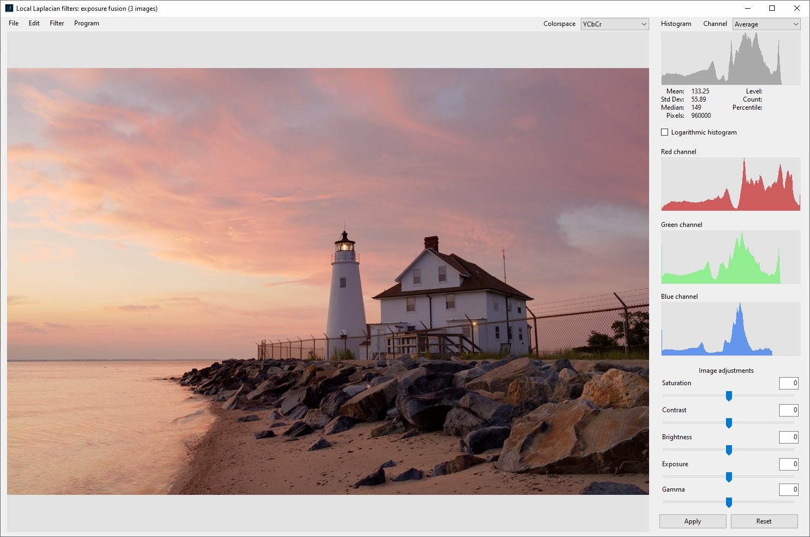
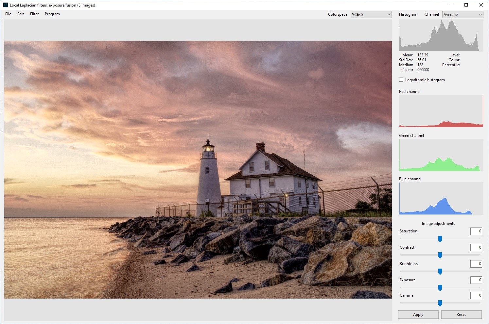

Desktop application for local Laplacian image filtering developed in C#.  

**Powered by [UMapx.NET](https://github.com/asiryan/UMapx.NET)**

# Installation
## System requirements
**Processor:** Intel® or AMD processor with 64-bit support (2 GHz or faster processor)  
**Operating system:** Microsoft Windows 7 (Microsoft Windows 10 recommended)  
**RAM:** 2 GB or more of RAM  
**Minimal resolution:** 1280 x 800 px  

## Dependencies
Download and move [**UMapx.dll**](https://github.com/asiryan/UMapx.NET/tree/master/release) to the root [**folder**](https://github.com/asiryan/Local-Laplacian-filters/tree/master/app) of the application.  
  

# Application
The application is designed for post-processing of raster images by correcting the dynamic range of brightness, local and global contrast, detail, saturation and exposure. It supports three color spaces: **YCbCr, HSL, HSB** and **grayscale** mode. The application includes the function of creating **HDR**-images from a series of images of different exposures (exposure fusion based on Laplacian pyramid technique [3]).  

## Exposure fusion

  

<b>Figure 1.</b> Images with different exposures
  
   

  

<b>Figure 2.</b> Exposure fusion
  

## Enhancement

  

<b>Figure 3.</b> Enhanced exposure fusion
   

# License
**GNU GPL v3.0**  

# References
1. Sylvain Paris, Samuel W. Hasinoff and Jan Kautz. Local Laplacian filters: edge-aware image processing with a Laplacian pyramid, ACM Trans. Graph. 30.4 (2011): 68 ([**pdf**](https://people.csail.mit.edu/sparis/publi/2011/siggraph/Paris_11_Local_Laplacian_Filters_lowres.pdf)).
2. Mathieu Aubry et al. Fast local laplacian filters: Theory and applications. ACM Transactions on Graphics (TOG) 33.5 (2014): 167 ([**pdf**](https://www.researchgate.net/publication/281950861_Fast_Local_Laplacian_Filters_Theory_and_Applications)).
3. Tom Mertens, Jan Kautz and Frank Van Reeth. Exposure Fusion. Pacific Graphics 2007: Proceedings of the Pacific Conference on Computer Graphics and Applications. Maui, HI, 2007, pp. 382–390 ([**pdf**](https://web.stanford.edu/class/cs231m/project-1/exposure-fusion.pdf)).
4. Mathworks: MATLAB - Fast local Laplacian filtering of images ([**page**](https://www.mathworks.com/help/images/ref/locallapfilt.html)).
