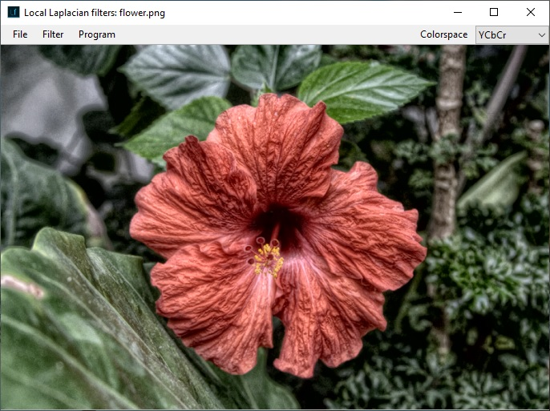

Desktop application for local Laplacian image filtering developed in C#.  

**Powered by [UMapx.NET](https://github.com/asiryan/UMapx.NET)**

# Installation
## System requirements
**Processor:** Intel® or AMD processor with 64-bit support (2 GHz or faster processor)  
**Operating system:** Microsoft Windows 7 (Microsoft Windows 10 recommended)  
**RAM:** 2 GB or more of RAM  
**Minimal resolution:** 1280 x 800 px  

## Dependencies
Download and install [.NET Framework 4](https://www.microsoft.com/en-US/Download/confirmation.aspx?id=17718).  
Download and move [UMapx.dll](https://github.com/asiryan/UMapx.NET/tree/master/release) to the root [folder](https://github.com/asiryan/Local-Laplacian-filters/tree/master/app) of the application.  
  

# Application
The application allows post-processing of raster images by correcting the dynamic range of brightness, local and global contrast, detail, saturation and brightness. It supports three color spaces: **YCbCr, HSL, HSB** and **grayscale** mode.  

## Before

## After

# License
**GNU GPL v3.0**  

# References
1. Paris, Sylvain, Samuel W. Hasinoff, and Jan Kautz. Local Laplacian filters: edge-aware image processing with a Laplacian pyramid, ACM Trans. Graph. 30.4 (2011): 68. [(pdf)](https://people.csail.mit.edu/sparis/publi/2011/siggraph/Paris_11_Local_Laplacian_Filters_lowres.pdf)
2. Aubry, Mathieu, et al. Fast local laplacian filters: Theory and applications. ACM Transactions on Graphics (TOG) 33.5 (2014): 167. [(pdf)](https://www.researchgate.net/publication/281950861_Fast_Local_Laplacian_Filters_Theory_and_Applications)
